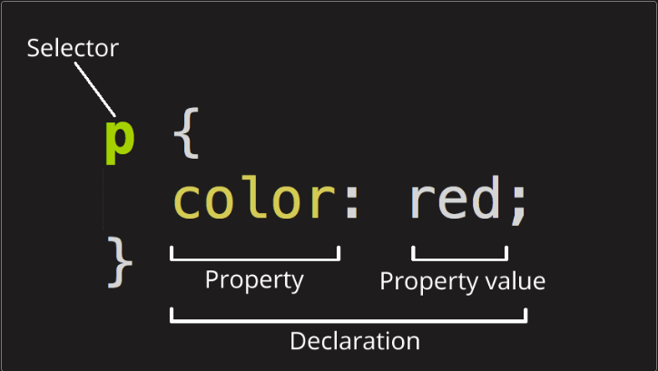

# CSS Skills

## Structure of CSS

Components

## Calling specific items

1. Element [Docs](https://developer.mozilla.org/en-US/docs/Web/CSS/Type_selectors)
2. all(\*) [Docs](https://developer.mozilla.org/en-US/docs/Web/CSS/Universal_selectors)
3. ID [Docs](https://developer.mozilla.org/en-US/docs/Web/CSS/ID_selectors)
4. Class [Docs](https://developer.mozilla.org/en-US/docs/Web/CSS/Class_selectors)

## Nesting CSS items

1. Class/ID then element or class
2. Calling multiple items

## Most common syntax

1. color
2. background (color, image)
3. height & width
4. font (weight, size, family)
5. display (flex, grid)
6. position (absolute, sticky, relative)
7. padding
8. margin
9. border
10. Using px or em or rem or vh/vw

## chit chat notes

-cascading style sheets
-reads top to bottom

selector {
property: property value
}
property+property value = declaration

-you can select multiple elements/classes/ids
-you can select all elements
-you can select items within an element/class/id
-stay specific with css

Rem: stays relative to size of initial set

vs

Em: multiplication by 2
